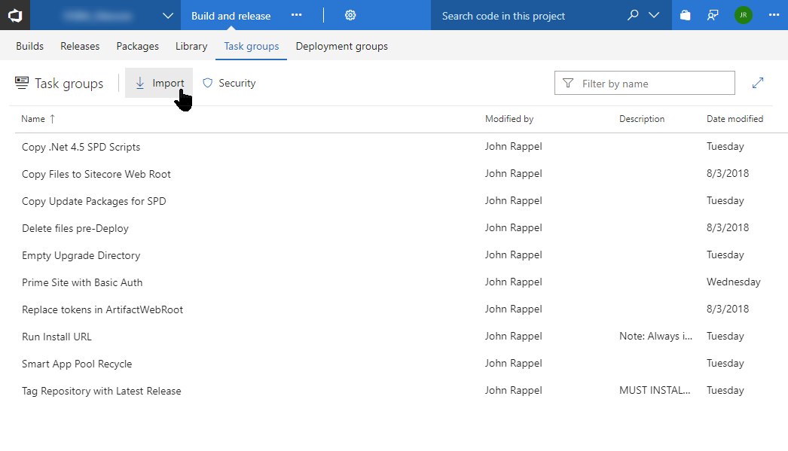
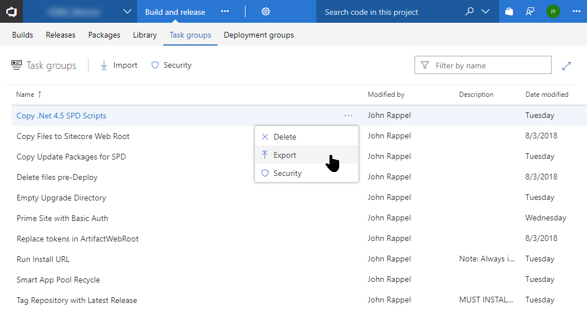
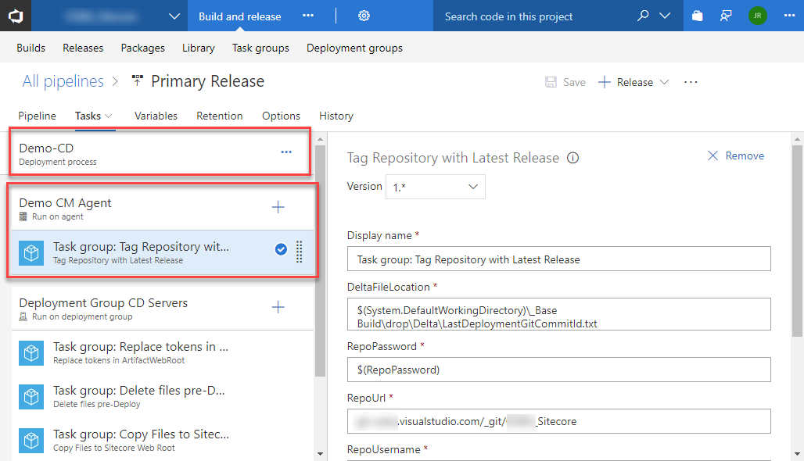

[<< Back to main README.md](../README.md)

Task Groups are extremely similar to Marketplace modules except they don't need to be published/packaged to begin using. They can be imported into an existing Release process and used as needed. They support default values and parameters. Choose from the library of Task Groups below and use as-needed.

## Import Release Task Groups into VSTS Project

Click to toggle contents...

## Export Release Task Groups

Click to toggle contents...

## Task Groups in SitecoreVSTS

Click to toggle contents...

---

#### Copy .Net 4.5 SPD Scripts
*   Dependent on: **Download GeekHive Scripts** Build Task, .Net 4.5 web project
*   Parameters: 
    *   SitecoreWebRoot
	    *   Default Value: **C:\inetpub\wwwroot\Sitecore\Website**
*   Notable Properties:
    *   Source Folder
	    *   Default Value: **$(System.DefaultWorkingDirectory)\_Base Build\drop\SitecoreVSTS\Scripts\SPD\Net4.5**
		*   Potential Changes: The path "_Base Build" is dependent on the name of your build. If the Build Template is used, it should default to "_Base Build".
*   This task copies all required code and config files to execute Sitecore Package Deployer to the web root.

---

#### Copy Files to Sitecore Web Root
*   Dependent on: N/A
*   Parameters: 
    *   SitecoreWebRoot
	    *   Default Value: **C:\inetpub\wwwroot\Sitecore\Website**
	*   WebDeployLocation
	    *   Default Value: **$(System.DefaultWorkingDirectory)\_Base Build\drop\_PublishedWebsites\TDS.Project**
		*   Update the **Default Value** to match your build artifact output.
*   Notable Properties: N/A
*   This task copies TDS Classic build output to the web root. This will be the compiled website.

---

#### Copy Update Packages for SPD
*   Dependent on: TDS Classic Update Packages
*   Parameters: 
    *   SPD.DataFolder
	    *   Default Value: **C:\inetpub\wwwroot\Sitecore\Data\SitecorePackageDeployer**
	*   TDSFolder.TDSProject.update
	    *   Default Value: **\*\***
		*   Update this value on each implementation of this Task Group. Do not modify the **Default Value**. An example implementation value would be *TDS.Content\TDS.Content.update*
*   Notable Properties:
    *   Source Folder
	    *   Default Value: **$(System.DefaultWorkingDirectory)\_Base Build\drop\_Packages**
		*   Potential Changes: The path "_Base Build" is dependent on the name of your build. If the Build Template is used, it should default to "_Base Build".
*   This task copies all listed TDS Update Packages to the Sitecore Package Deployer folder.

---

#### Delete files pre-Deploy
*   Dependent on: N/A
*   Parameters: 
    *   PathsFilesToDelete
	    *   Default Value: (none)
	*   WebDeployLocation
	    *   Default Value: **$(System.DefaultWorkingDirectory)\_Base Build\drop\_PublishedWebsites\TDS.Project**
		*   Update this value to point to the output of your TDS web project output.
*   Notable Properties: N/A
*   This task simply removes any files not needed for a particular environment prior to copying the contents of the webroot. For example, a CD environment may need particular files removed prior to copying.

---

#### Empty Upgrade Directory
*   Dependent on: N/A
*   Parameters: 
    *   SitecoreWebRoot
	    *   Default Value: **C:\inetpub\wwwroot\Sitecore\Website**
*   Notable Properties: N/A
*   This task empties the *~\temp\__UpgradeHistory* folder. This folder will contain all SPD installs. After a while, it can grow quite large if this maintenance task is not in place.

---

#### Prime Site
*   Dependent on: **Download GeekHive Scripts** Build Task
*   Parameters: 
    *   BasicAuthPassword
	    *   Default Value: (none)
	*   BasicAuthUsername
	    *   Default Value: (none)
	*   primeUrl
	    *   Default Value: http://site.name
		*   Update this value on each implementation of this Task Group.
*   Notable Properties:
    *   Script Path
	    *   Default Value: **$(System.DefaultWorkingDirectory)\_Base Build\drop\SitecoreVSTS\Scripts\All\Execute Url\ExecuteUrl.ps1**
		*   Potential Changes: The path "_Base Build" is dependent on the name of your build. If the Build Template is used, it should default to "_Base Build".
	*   Working Directory (Advanced Section)
	    *   Default Value: **$(System.DefaultWorkingDirectory)\_Base Build\drop\SitecoreVSTS\Scripts\All\Execute Url**
		*   Potential Changes: The path "_Base Build" is dependent on the name of your build. If the Build Template is used, it should default to "_Base Build".
*   This task relies simply issues a request to a website/page. If Basic Authentication support is required, enter a username and password. If not, leave blank.

---

#### Replace tokens in ArtifactWebRoot
*   Dependent on: [**Replace Tokens** Marketplace module](https://marketplace.visualstudio.com/items?itemName=qetza.replacetokens).
*   Parameters: 
    *   ArtifactWebRoot
	    *   Default Value: **$(System.DefaultWorkingDirectory)\_Base Build\drop\_PublishedWebsites\TDS.Project**
		*   Potential Changes: The path "_Base Build" is dependent on the name of your build. If the Build Template is used, it should default to "_Base Build".
*   Notable Properties: 
    *   Target files
	    *   Default Value: **\*\*/\*.config
		*   This likely does not need to change. It targets all config files for replacement values.
	*   Token prefix
	    *   Default Value: **\#\{**
		*   This is likely the proper value, however if you are targeting replacements in a different way, update this value.
	*   Token suffix
	    *   Default Value: **\}\#**
		*   This is likely the proper value, however if you are targeting replacements in a different way, update this value.
*   This task replaces tokens in config files. For example, if you are transforming a *.Release.config with a value of **\#\{WebDatabaseConnectionString\}\#**, this task will review Release Variables for any match for the specific environment for **WebDatabaseConnectionString** and include the proper value.

---

#### Run Install URL
*   Dependent on: **Download GeekHive Scripts** Build Task, **Copy Update Packages for SPD** Release Task, **Copy .Net X.X SPD Scripts** Release Task
*   Parameters: 
    *   BasicAuthPassword
	    *   Default Value: (none)
	*   BasicAuthUsername
	    *   Default Value: (none)
	*   hostname
	    *   Default Value:  **http://site.name**
*   Notable Properties:
    *   Script Path
	    *   Default Value: **$(System.DefaultWorkingDirectory)\_Base Build\drop\SitecoreVSTS\Scripts\All\Execute Url\ExecuteUrl.ps1**
		*   Potential Changes: The path "_Base Build" is dependent on the name of your build. If the Build Template is used, it should default to "_Base Build".
	*   Arguments
	    *   Default Value: **-SiteUrl '$(hostname)/StartSitecorePackageDeployer.aspx?response=json' -Username $(BasicAuthUsername) -Password $(BasicAuthPassword) -RepeatInterval 3**
		*   Potential Changes: If Basic Authentication is not required, leave these fields blank. Repeat Inverval is in *seconds*.
	*   Working Directory (Advanced Section)
	    *   Default Value: **$(System.DefaultWorkingDirectory)\_Base Build\drop\SitecoreVSTS\Scripts\All\Execute Url**
		*   Potential Changes: The path "_Base Build" is dependent on the name of your build. If the Build Template is used, it should default to "_Base Build".
*   This task installs all Update Packages in the Sitecore Package Deployer folder. It performs an *asynchronous* install. Every *RepeatInterval* seconds it checks the current status of the install. It only ends the task once all Update Packages have been installed.

---

#### Smart AppPool Recycle
*   Dependent on: **Download GeekHive Scripts** Build Task
*   Parameters: 
    *   AppPoolName
	    *   Default Value: (none)
		*   The name of the application pool in IIS that you are targeting. *Modify this per implementation.*
*   Notable Properties:
    *   Script Path
	    *   Default Value: **$(System.DefaultWorkingDirectory)\_Base Build\drop\SitecoreVSTS\Scripts\All\recycle-app-pool.ps1**
		*   Potential Changes: The path "_Base Build" is dependent on the name of your build. If the Build Template is used, it should default to "_Base Build".
	*   Arguments
	    *   Default Value: **-AppPool $(AppPoolName) -Count 10 -Delay 30000**
		*   Potential Changes: It will perform 10 *checks*, one every 30 seconds by default, for a total runtime of 5 minutes. Modify as-needed.
	*   Working Directory (Advanced Section)
	    *   Default Value: **$(System.DefaultWorkingDirectory)\_Base Build\drop\SitecoreVSTS\Scripts**
		*   Potential Changes: The path "_Base Build" is dependent on the name of your build. If the Build Template is used, it should default to "_Base Build".
*   This task recycles the web application pool. It ensures that a brand new app pool is ready after the task is complete, as opposed to allowing a lingering/obsolete app pool that may serve requests. **Note: this task requires that the agent running the deployment has permission to perform an app pool recycle.**

---

#### Tag Repository with Latest Release
*   Dependent on: **Download GeekHive Scripts** Build Task, [Git installed on server](https://git-scm.com/download/win) (must restart agent to see additional capability), [GitDeltaDeploy](https://www.nuget.org/packages/Hedgehog.TDS.BuildExtensions.GitDeltaDeploy/) configured and enabled (if not enabled, this task will fail, but continue. It is enabled at build queue time)
*   Parameters: 
    *   DeltaFileLocation
	    *   Default Value: **$(System.DefaultWorkingDirectory)\_Base Build\drop\Delta\LastDeploymentGitCommitId.txt**
		*   The path "_Base Build" is dependent on the name of your build. If the Build Template is used, it should default to "_Base Build".
	*   RepoPassword
	    *   Default Value: **<use a secure variable to hold this>**
		*   ***Use a secure VSTS Release Variable to hold the repository password.***
	*   RepoUrl
	    *   Default Value: **project.visualstudio.com/_git/projectname**
		*   The link to the Git repository. Note: do not include the "https://" portion of the URL.
	*   RepoUsername
	    *   Default Value: **name%40email.com**
		*   The email/username for the Git repository. Note: **'@'** must be encoded to **'%40'** in an email.
	*   TempRepoLocation
	    *   Default Value: **C:\agent\Repo Temp**
		*   The path where the repository will be cloned to. This directory will be created and removed during execution.
*   Notable Properties:
    *   Script Path
	    *   Default Value: **$(System.DefaultWorkingDirectory)\_Base Build\drop\SitecoreVSTS\Scripts\CM Only\TagRepo.ps1**
		*   Potential Changes: The path "_Base Build" is dependent on the name of your build. If the Build Template is used, it should default to "_Base Build".
	*   Arguments
	    *   Default Value: **-RepoUrl "$(RepoUrl)" -Username $(RepoUsername) -Password $(RepoPassword) -Location "$(TempRepoLocation)" -DeltaFile "$(DeltaFileLocation)"**
		*   Potential Changes: Likely no changes needed.
	*   Working Directory (Advanced Section)
	    *   Default Value: **$(System.DefaultWorkingDirectory)\_Base Build\drop\SitecoreVSTS\Scripts\CM Only**
		*   Potential Changes: The path "_Base Build" is dependent on the name of your build. If the Build Template is used, it should default to "_Base Build".
	*   Continue on error (Control Options Section)
	    *   Default Value: **<checked>**
		*   Potential Changes: Because this task can fail when GitDeltaDeploy is not enabled for a build, it intentionally continues on error.
*   This task automatically tags the current commit with the tag **"ProductionRelease"**. This enables GitDeltaDeploy to be fully automated. Only run this task on a CM server as part of a CD deployment. **See image below for executing a CM agent from a CD Task.**

---

