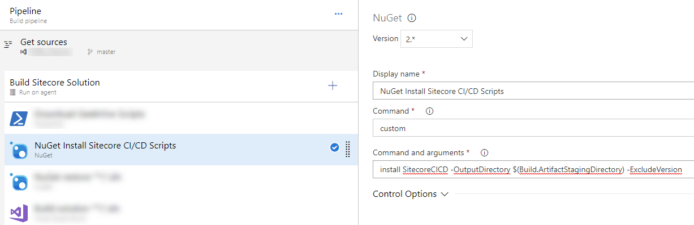

[<< Back to main README.md](../README.md)

A collection of PowerShell scripts designed to aid in the efficiency of Sitecore CI/CD deployments. These scripts are non-specific to VSTS. They can be used anywhere that PowerShell is available.

# Usage

_(VSTS example image below, but applicable to all CICD tools)_

These scripts follow a "Build once, deploy many" philosophy. The NuGet package must be installed and included in the build artifacts. This allows the scripts to be used during the build _and_ release process. Install as an early step in the build process.

`nuget.exe Install SitecoreCICD -OutputDirectory "YourBuildArtifactsDirectoryThatGetPromoted" -ExcludeVersion`

## All

Scripts designed to be executed in a variety of server configurations.

Click to toggle contents...

### [recycle-app-pool.ps1 (VM Specific)](All/recycle-app-pool.ps1)

This script intelligently recycles an app pool on a VM. It ensures a new app pool is running when the script execution completes. It requires elevated permissions in order to access the list of application pools.

#### Example

`$(System.DefaultWorkingDirectory)\_Base Build\drop\SitecoreCICD\All\recycle-app-pool.ps1 -AppPool $(AppPoolName) -Count 10 -Delay 30000`

### [kill-app-service-site.ps1 (PaaS Specific)](All/kill-app-service-site.ps1)

This script intelligently kills the w3wp worker process on the specified App Service. This method is significantly faster than restarting the web app. It is designed to freshen up the worker process prior to a deployment.

#### Example

`$(System.DefaultWorkingDirectory)\_Base Build\drop\SitecoreCICD\All\kill-app-service-site.ps1 -userId $(AzureUserName) -password $(AzurePassword) -subscriptionId $(AzureSubscriptionId) -resourceGroupName $(ReleaseSpecificResourceGroup) -appServiceName $(ReleaseSpecificAppServiceName)`

_Note: It is recommended that the `password` parameter use a secure variable. Secure variables are never listed in output._

### [ExecuteUrl.ps1](All/Execute%20Url/ExecuteUrl.ps1)

This script, along with the accompanying `curl.exe` and `libcurl.dll`, request a URL and return the response. This script has many modes of operation.

*   If Username and Password are included, it performs a request with Basic Authentication
    *   If excluded, the request runs as expected without Basic Authentication
*   If a `RepeatInterval` is included (value greater than 0), it will re-request the URL. This is pivotal to the Sitecore Package Deployer installation.

#### Example of Sitecore Package Deployer Use

`$(System.DefaultWorkingDirectory)\_Base Build\drop\SitecoreCICD\All\Execute Url\ExecuteUrl.ps1 -SiteUrl "$(hostname)/StartSitecorePackageDeployer.aspx?response=json'&'pauseEvents=false" -Username $(BasicAuthUsername) -Password $(BasicAuthPassword) -RepeatInterval 3`

_Note: This will repeatedly ping SPD and report the installation status. It will exit once installation has fully completed._

#### Example of Requesting Site URL

`$(System.DefaultWorkingDirectory)\_Base Build\drop\SitecoreCICD\All\Execute Url\ExecuteUrl.ps1 -SiteUrl '$(primeUrl)' -Username $(BasicAuthUsername) -Password $(BasicAuthPassword)`

_Note: BasicAuthUsername and BasicAuthPassword are optional._

## Build

Scripts designed specifically to be used during a build process.

Click to toggle contents...

### [RemoveFilesFromTDSPackage.ps1](Build/RemoveFilesFromTDSPackage.ps1)

This script recursively searches directories for *.update packages. When found, it removes all DLL's from the \\bin folder that resides in the update package. This removes the possibility of an update package installation from causing a soft app pool recycle with the inclusion of a DLL. It works best when TDS update packages are configured to include **items only**.

#### Example

`$(Build.ArtifactStagingDirectory)\SitecoreCICD\Build\RemoveFilesFromTDSPackage.ps1 -pathToPackages "$(Build.ArtifactStagingDirectory)\_Packages"`

**Credit: Rob Ahnemann - http://www.rockpapersitecore.com/about-me/**

## CM Only

Scripts designed specifically to be used on a Content Management server or at the very least a non-CD server (dev/integration).

Click to toggle contents...

## [TagRepo.ps1](CM%20Only/TagRepo.ps1)

This script should be used in conjunction with GitDeltaDeploy. GitDeltaDeploy must be enabled for this task to execute properly. It also has a dependency that Git be installed on the VM this task runs on.

#### Example

`$(System.DefaultWorkingDirectory)\_Base Build\drop\SitecoreCICD\CM Only\TagRepo.ps1 -RepoUrl "$(RepoUrl)" -Username $(RepoUsername) -Password $(RepoPassword) -Location "$(TempRepoLocation)" -DeltaFile "$(DeltaFileLocation)"`

_Note: GitDeltaDeploy will create a file as part of the build output at '~\Delta\LastDeploymentGitCommitId.txt'. The location of this text file is what is required for the '-DeltaFile' parameter._

## SPD

Utilities to be installed (copied) to a Sitecore instance to provide Sitecore Package Deployer (SPD) functionality. In this configuration, SPD is designed to _not_ be included in the web project/solution.

Click to toggle contents...

### [Net4.5/Net4.6](SPD)

Target the proper version for your web project, respectively.  The contents of the chosen folder should be copied directly to the Content Management Server web root.

This version of SPD follows the progress on the following Fork: https://github.com/jraps20/SitecorePackageDeployer

It adds support for the following:
*   

